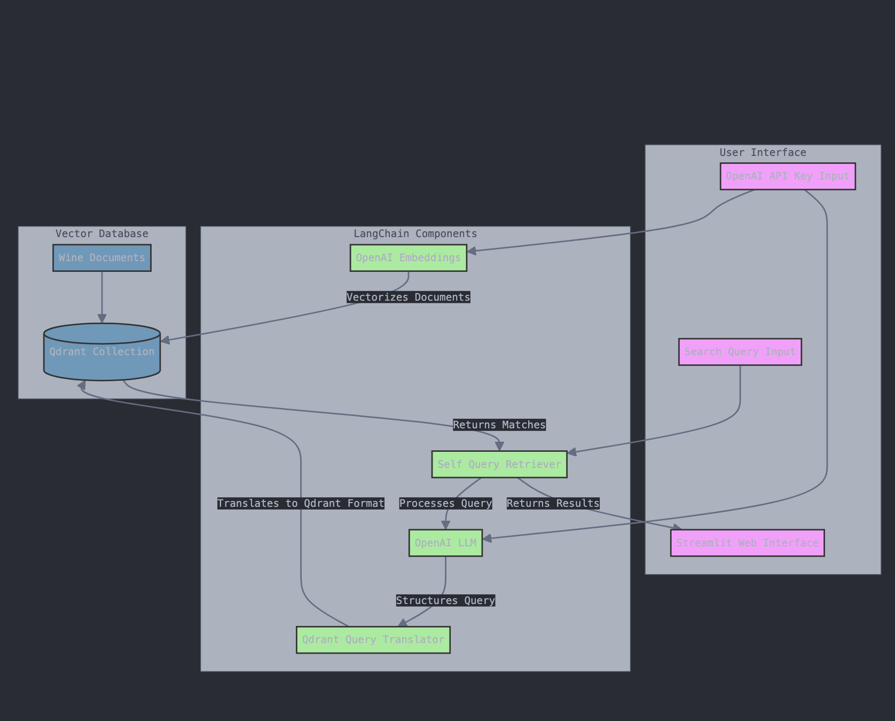

# 🍷 Wine Query System

A sophisticated natural language querying system for searching and exploring a wine collection, powered by **Streamlit**, **LangChain**, **OpenAI**, and **Qdrant**.

## Features

- Perform natural language queries on a collection of wines.
- Filter by attributes like **rating**, **grape type**, **year**, **color**, and **country**.
- Leverages **LangChain** for query processing and **Qdrant** for vector-based document retrieval.
- Interactive UI with expandable search result cards.
- Easily reset and manage the database.

---

## System Architecture

The application consists of the following components:

### 📦 Libraries and Frameworks

- **Streamlit**: For building an interactive UI.
- **LangChain**: For natural language query understanding.
- **OpenAI**: For embedding generation and LLM-powered query processing.
- **Qdrant**: As the vectorstore for efficient document retrieval.

### 🗃️ Sample Wine Dataset

The dataset includes wines with attributes like:

- **Name**
- **Year**
- **Rating**
- **Grape type**
- **Color**
- **Country**
- **Description**

### 🛠️ System Flow



## 🛠️ Setup and Installation

1. **Clone the repository**:

   ```bash
   git clone <repository-url>
   cd wine-query-system
   ```

2. **Install dependencies after creating virtual environment**:

   ```bash
   python3 -m venv .venv
   source .venv/bin/activate
   ```

   ```bash
   pip install -r requirements.txt
   ```

3. **Set up your environment variables**:

   - Add your OpenAI API Key and Qdrant credentials to the `secrets.toml` file under `.streamlit`:
     ```toml
     [QDRANT]
     QDRANT_URL = "<your-qdrant-url>"
     QDRANT_API_KEY = "<your-qdrant-api-key>"
     ```

4. **Run the application**:

   ```bash
   streamlit run app.py
   ```

5. Open your browser and navigate to `http://localhost:8501`.

---

## 🔍 Example Queries

Try the following sample queries:

- "Show me all red wines."
- "What wines have a rating above 95?"
- "I want a wine that has fruity notes and has a rating above 97."
- "What wines come from Italy?"
- "What's a wine after 2015 but before 2020 that's earthy?"

---

## How It Works

1. **Input Query**: Users enter a natural language query into the Streamlit UI.
2. **Query Processing**: The query is processed by LangChain using the OpenAI API.
3. **Document Retrieval**: Qdrant retrieves relevant documents using cosine similarity on embeddings.
4. **Results Display**: The app displays results with detailed wine metadata and descriptions in expandable cards.

---

## 🙏 Acknowledgments

- **LangChain** for seamless integration of LLMs and vectorstores.
- **Qdrant** for high-performance vector-based retrieval.
- **Streamlit** for making interactive UI development a breeze.

---
